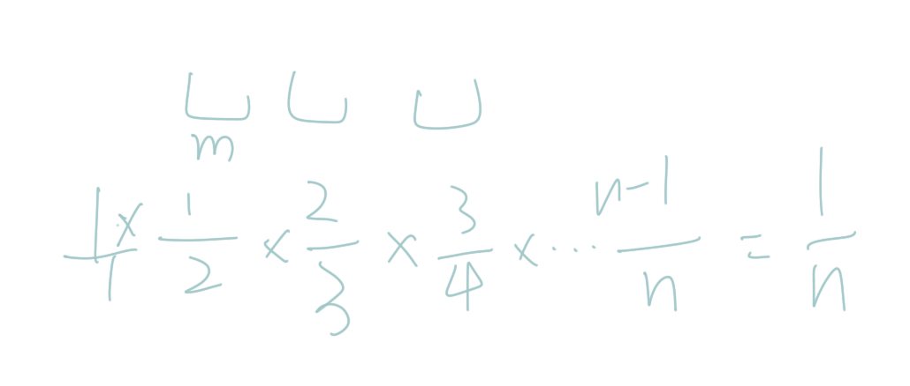

这道题关键是随机的算法。  
对于数字m，本来在位置0，其留在0的几率如图 1/n.


```java
class Solution {
    int[] nums;
    Random rdn;

    public Solution(int[] nums) {
        this.nums = nums;
        this.rdn = new Random();
    }

    /** Resets the array to its original configuration and return it. */
    public int[] reset() {
        return nums;
    }

    /** Returns a random shuffling of the array. */
    public int[] shuffle() {
        int[] res = Arrays.copyOf(nums, nums.length);
        for (int i = 0; i < nums.length; i++) {
            swap(res, rdn.nextInt(i + 1), i);
        }
        return res;
    }

    private void swap(int[] a, int i, int j) {
        int t = a[i];
        a[i] = a[j];
        a[j] = t;
    }
}
```
