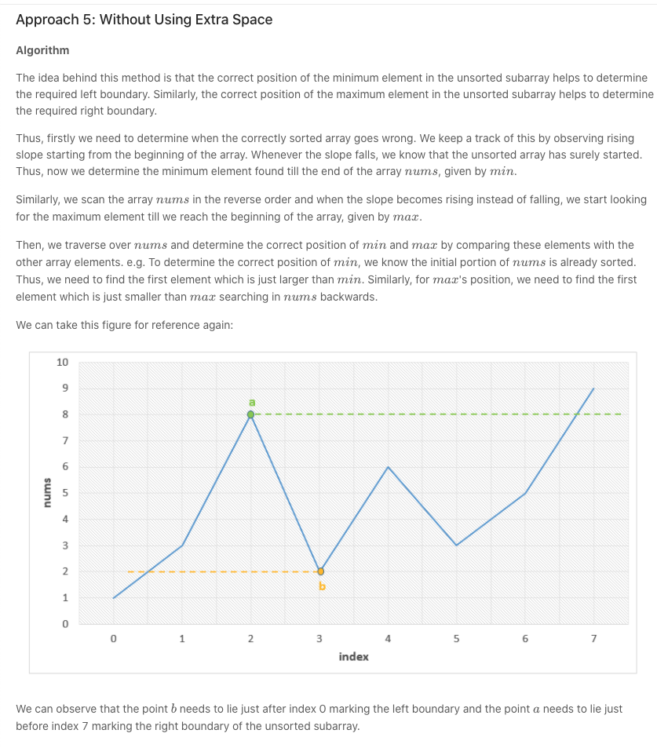

很简单，如果最右端的一部分已经排好序，这部分的每个数都比它左边的最大值要大，同理，如果最左端的一部分排好序，这每个数都比它右边的最小值小。所以我们从左往右遍历，如果i位置上的数比它左边部分最大值小，则这个数肯定要排序， 就这样找到右端不用排序的部分，同理找到左端不用排序的部分，它们之间就是需要排序的部分
```java
class Solution {
    public int findUnsortedSubarray(int[] nums) {
        //右区间起点前一位，左区间终点后一位  
        int l = 0, r = 0;
        int max = Integer.MIN_VALUE;
        int min = Integer.MAX_VALUE;

        for (int i = 0; i < nums.length; i++) {
            if (nums[i] < max) {
                r = i;
            }
            max = Math.max(max, nums[i]);
        }

        for (int i = nums.length - 1; i >= 0; i--) {
            if (nums[i] > min) {
                l = i;
            }
            min = Math.min(min, nums[i]);
        }

        //如果数组本身有序，l,r未被update, 都为0
        return l == r ? 0 : r - l + 1;
    }
}
```

上面解法是考虑a，b, c段的ac段端点，下面leetcode解法是找出b段两端点。  
  
```java
public class Solution {
    public int findUnsortedSubarray(int[] nums) {
        int min = Integer.MAX_VALUE, max = Integer.MIN_VALUE;
        boolean flag = false;
        for (int i = 1; i < nums.length; i++) {
            if (nums[i] < nums[i - 1])
                flag = true;
            if (flag)
                min = Math.min(min, nums[i]);
        }
        flag = false;
        for (int i = nums.length - 2; i >= 0; i--) {
            if (nums[i] > nums[i + 1])
                flag = true;
            if (flag)
                max = Math.max(max, nums[i]);
        }
        int l, r;
        for (l = 0; l < nums.length; l++) {
            if (min < nums[l])
                break;
        }
        for (r = nums.length - 1; r >= 0; r--) {
            if (max > nums[r])
                break;
        }
        return r - l < 0 ? 0 : r - l + 1;
    }
}
```
